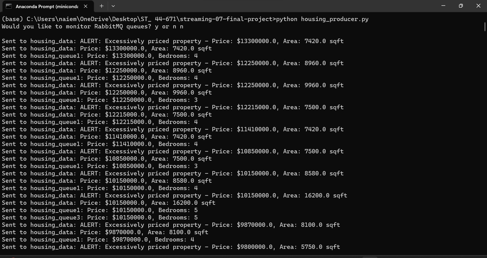
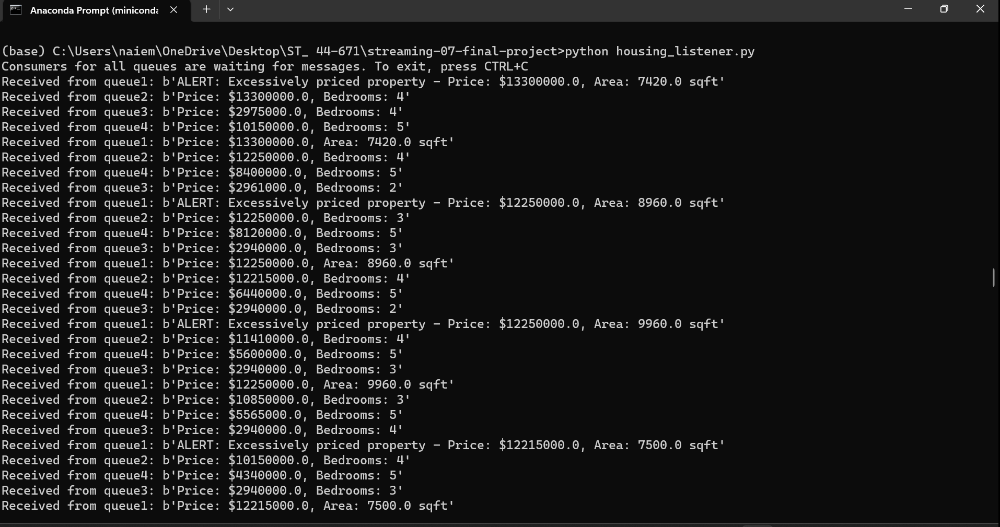
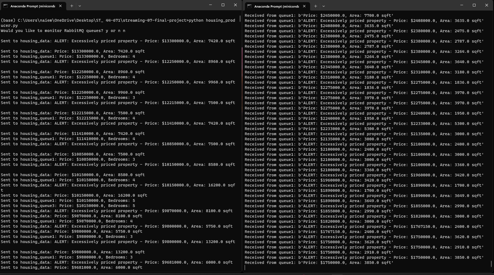
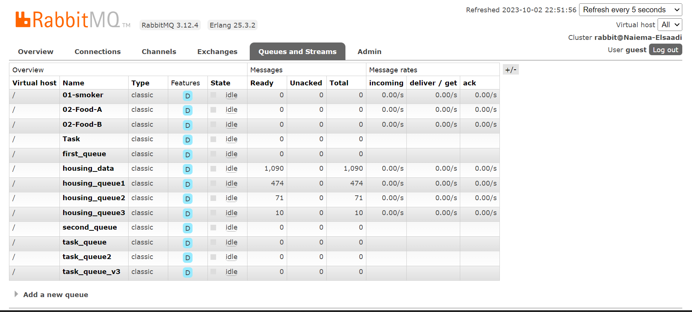
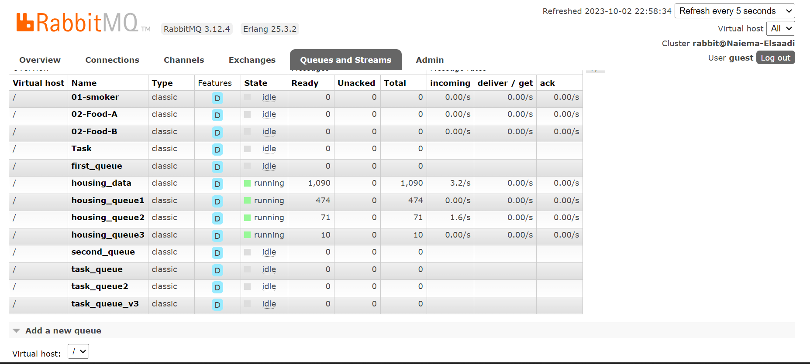
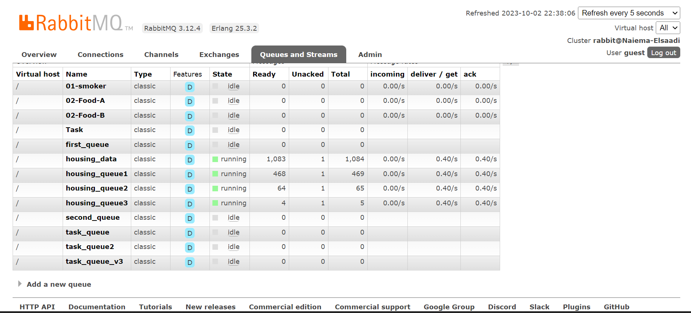

# streaming-07-final-project

This project implements a streaming analytics solution using RabbitMQ for processing housing data. The primary goal is to efficiently handle and analyze housing-related information in real-time. By leveraging RabbitMQ as the message broker, the project aims to distribute and process housing data messages based on specific criteria, such as price and bedrooms.

 Author: Naiema Elsaadi
 Date: September 30, 2023 

## Table of Contents

- [Overview](#overview)
- [Prerequisites](#prerequisites)
- [How to Run](#how-to-run)
- [Project Structure](#project-structure)
- [How It Works](#how-it-works)
- [Screenshots](#screenshots)
- [RabbitMQ Console](#rabbitmq-console)

## Overview

This program is useful for analyzing and categorizing housing data efficiently, allowing you to monitor and respond to specific conditions in the real estate market. For example, you can keep track of excessively priced properties, high-value properties, low-value properties, and houses with a specific number of bedrooms, all in real-time.

## Data Sources

The project utilizes synthetic housing data generated using the Faker library. This synthetic data includes details such as price, area, and the number of bedrooms. While real data could be used, synthetic data ensures privacy and reproducibility for testing and development.

 <b> Source Data for csv file:</b>

https://www.kaggle.com/datasets/yasserh/housing-prices-dataset

## Prerequisites

<b>Before running the project, ensure you have the following prerequisites:</b>

- Git
- RabbitMQ server running
- Python 3.10+ installed
- VS studio Code
- anaconda prompt (miniconda3)
- The following modules are used in this project:
 pika
 csv
 webbrowser
 time 
- Required Python libraries (e.g., pika) installed in your active environment

## How to Run

<b>Follow these steps to run the project:</b>

1. Clone the repository to your local machine:
2. Navigate to the project directory:
3. Start the producer to collect sending housing data:
4. Open separate terminal windows and start the producer and consumer for housing data:

 <b>Housing_producer:python housing_producer.py</b>

 <b>Housing_consumer:python housing_listener.py</b>

## Project Structure

<b>The project structure is organized as follows:</b>
  streaming-05-getting-started/
  housing_producer.py
  housing_listener.py
  Housing.csv
  Screenshots for running 

## Process Overview

### Producer

The script includes a custom producer script (`housing_producer.py`) responsible for sending housing data messages to RabbitMQ. This producer generates and sends data every 5 seconds, simulating a continuous data stream.

### Consumer

The script includes a consumer script (`housing_listener.py`) designed to listen to and consume messages from RabbitMQ. It sets up multiple consumers, each responsible for processing messages from different queues:

- **QUEUE_NAME_1**: Houses with alert messages for excessively priced properties.
- **QUEUE_NAME_2**: Houses with high prices.
- **QUEUE_NAME_3**: Houses with low prices.
- **QUEUE_NAME_4**: Houses with 5 bedrooms.

### RabbitMQ Configuration

The project configures RabbitMQ with multiple queues and exchanges to route and distribute messages effectively. Queues are declared as durable to ensure data persistence.

## Output and Results

The project's results can be observed without the need to execute Python code. The consumer script (`housing_listener.py`) prints received messages, including the queue they originated from, to the console. You can monitor the real-time message processing by running the consumer script in multiple terminals.

## How It Works

<b>Producer Script (housing_producer.py):</b>

The producer script reads housing data from a CSV file containing information about various houses, including their prices, areas, and the number of bedrooms.It establishes a connection to a RabbitMQ server, where it sends messages to different queues depending on the characteristics of each house:

1. Queue 1 (housing_data): This queue receives messages for houses with prices greater than or equal to $300,000. It specifically sends an alert message for excessively priced properties and general messages about the house's price and area.
2. Queue 2 (housing_queue1): Houses with prices greater than or equal to $3,000,000 are sent to this queue. The message includes the price and the number of bedrooms.

3. Queue 3 (housing_queue2): For houses with prices less than $3,000,000, this queue receives messages containing the price and the number of bedrooms.

4. Queue 4 (housing_queue3): If a house has 5 bedrooms, a message including its price and bedroom count is sent to this queue. There's also a 2-second delay between processing and sending messages to this queue.
All messages sent by the producer script are marked as persistent, ensuring they can survive server restarts.

## Usage:

Run the producer script (housing_producer.py) to process the housing data and send messages to the appropriate queues based on the specified criteria.

You can monitor the RabbitMQ queues by answering "y" when prompted to open the RabbitMQ Admin website. This will allow you to view queue statistics and monitor message flow.

This program is useful for analyzing and categorizing housing data efficiently, allowing you to monitor and respond to specific conditions in the real estate market. For example, you can keep track of excessively priced properties, high-value properties, low-value properties, and houses with a specific number of bedrooms, all in real-time.

## Screenshots

## Producer and Consumers
 <b>Here is a screenshots of the multiple terminals with producer and consumer.</b>

 <b> housing producer</b>

 <b> housing consumer</b>

 <b> multiple terminals</b>

## RabbitMQ Console

 Here is a screenshot of the RabbitMQ console with the producer and consumer running, showing message queues and message traffic:

 <b>Screenshot for running the housing_producer:</b>

 <b>Screenshot for running the housing_consumer</b>

## Reference

<b> https://www.rabbitmq.com/tutorials/tutorial-two-python.html

  https://github.com/denisecase/streaming-04-multiple-consumers/blob/main/v2_listening_worker.py

